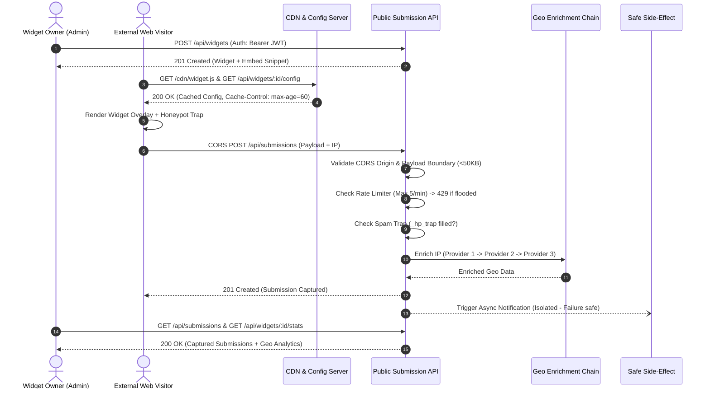

# FlyRank Capstone — Cross-Origin Embeddable Widget Platform

> **The "Public Internet is Your Input" Capstone**
> 
> A production-grade multi-tenant platform that lets customers define customizable web widgets (popovers, signup forms, CTAs), embed them on any external website via a one-line `<script>` tag, and capture cross-origin submissions back to a hardened backend with **dynamic CORS validation**, **input boundary enforcement**, **abuse controls (honeypot + 429 rate limiter)**, a **3-provider IP→Geo enrichment fallback chain**, and **safe isolated side-effects**.

---

## 📐 Architecture & Data Flow Diagram

```
                               ┌───────────────────────────┐
                               │     Owner Admin (JWT)     │
                               └─────────────┬─────────────┘
                                             │
                        POST /api/widgets    │  GET /api/submissions
                        (Tenant Isolated)    │  GET /api/widgets/:id/stats
                                             ▼
                               ┌───────────────────────────┐
                               │  Backend API & Store      │
                               └─────────────┬─────────────┘
                                             │
                                             │ GET /api/widgets/:id/config
                                             │ (Cache-Control: max-age=60)
                                             ▼
┌────────────────────────────────────────────────────────────────────────────────────────┐
│  External Customer Website (2nd Origin / Host Site)                                    │
│                                                                                        │
│  <script src="http://localhost:4000/cdn/widget.js" data-widget-id="..." async></script>│
│  └─► Auto-renders Popup / Form Overlay with Theme & Honeypot Trap                      │
└────────────────────────────────────────────┬───────────────────────────────────────────┘
                                             │
                                             │ CORS POST /api/submissions
                                             ▼
                               ┌───────────────────────────┐
                               │ 1. Dynamic CORS Check     │
                               │ 2. Boundary Validation    │
                               │ 3. Rate Limiter (5/min)   │ ──► Returns 429 if exceeded
                               │ 4. Spam Filter (Honeypot) │ ──► Flags is_spam: true
                               └─────────────┬─────────────┘
                                             │
                                             ▼
                               ┌───────────────────────────┐
                               │ IP → Geo Fallback Chain   │
                               │ Provider 1 (Primary)      │ ──► [Fails/Down?]
                               │   └─► Provider 2 (Backup) │ ──► [Fails/Down?]
                               │         └─► Provider 3    │ (Default Fallback)
                               └─────────────┬─────────────┘
                                             │
                                             ▼
                               ┌───────────────────────────┐
                               │ Save Submission & Return  │ ──► 201 Created Response
                               └─────────────┬─────────────┘
                                             │ (Safe Isolated Side-Effect)
                                             ▼
                               ┌───────────────────────────┐
                               │ Asynchronous Webhook      │ (Failure does NOT fail
                               └───────────────────────────┘  the submission response!)
```



---

## ⚡ Key Features & Definition of Done

1. **Multi-Tenant Admin Widget Platform**:
   - Authenticated CRUD for widgets (`POST`, `GET`, `PUT`, `DELETE` at `/api/widgets`).
   - Tenant isolation enforced on all queries (`WHERE tenant_id = ...`).
   - Automatic embed snippet generator: `<script src="http://localhost:4000/cdn/widget.js" data-widget-id="WIDGET_ID" async></script>`.

2. **Cached CDN Config Delivery**:
   - `GET /api/widgets/:id/config` serves minimal JSON with CDN headers (`Cache-Control: public, max-age=60, s-maxage=300`).
   - Cross-Origin script execution auto-detects `data-widget-id` and renders the overlay DOM.

3. **Public Submission Boundary & CORS**:
   - Preflight `OPTIONS /api/submissions` support.
   - Origin validation against widget `allowed_origins`.
   - Input boundary validation enforcing required fields and payload size limits (< 50KB).

4. **Abuse Resistance (Rate-Limiter & Bot Spam Defense)**:
   - Rate limiter capping submissions at 5 requests per minute per IP/widget (returns `429 Too Many Requests`).
   - Honeypot bot trap field (`_hp_trap`). If filled by automated scrapers/bots, it is caught and flagged as `is_spam: true`.

5. **IP→Geo Enrichment Fallback Chain**:
   - **Provider 1 (Primary)**: MaxMind / Primary Geo API.
   - **Provider 2 (Secondary)**: IpApi / Backup Geo API.
   - **Provider 3 (Fallback)**: Local Default Resolver.
   - Degrades gracefully — if Provider 1 fails or is toggled down, Provider 2 takes over seamlessly!

6. **Safe Side Effects Isolation**:
   - Webhook & email notifications execute in isolated asynchronous blocks (`setImmediate`).
   - If the downstream webhook server crashes (500) or times out, the submission **still succeeds** (`201 Created`).

7. **Owner Dashboard & Analytics**:
   - `GET /api/submissions`: List captured submissions for owner widgets.
   - `GET /api/widgets/:id/stats`: Total submissions, clean vs spam breakdown, spam rate, and country distribution.

---

## 🚀 Quick Start Guide

### 1. Installation

```bash
cd capstone-widget-platform
npm install
```

### 2. Start Server

```bash
npm start
```

Output:
```text
🚀 Capstone Widget Platform running on http://localhost:4000
   📦 CDN Script:           http://localhost:4000/cdn/widget.js
   🌐 Customer Site Demo:   http://localhost:4000/demo/customer-site.html
   📊 Admin API Base:       http://localhost:4000/api/widgets
```

### 3. Open Demo Page

Open **`http://localhost:4000/demo/customer-site.html`** in your browser.
This page simulates a second, external customer website loading your widget script cross-origin!

Interactive demo buttons let you test:
- 1. Valid Submission & Geo Enrichment
- 2. Triggering the `429` Rate Limiter (6 rapid requests)
- 3. Honeypot Bot Attack
- 4. Toggling Geo Provider 1 Down (Verifying Provider 2 Takeover)
- 5. Side-Effect Webhook Failure Simulation

---

## 🧪 Running Automated Tests

```bash
npm test
```

Expected output:
```text
🧪 Running Capstone Widget Platform Test Suite...

  📋 1. Admin Authentication & Tenant Isolation
  ✅ PASS  Admin login returns 200
  ✅ PASS  JWT token returned
  ✅ PASS  POST /api/widgets creates widget (201)
  ✅ PASS  Embed snippet returned
  ✅ PASS  GET /api/widgets returns 200

  📋 2. Config Delivery & Cache Headers
  ✅ PASS  GET /api/widgets/:id/config returns 200
  ✅ PASS  Cache-Control header configured

  📋 3. CORS Preflight & Header Support
  ✅ PASS  CORS Preflight OPTIONS /api/submissions → 204
  ✅ PASS  Access-Control-Allow-Origin header set

  📋 4. Boundary Input Validation
  ✅ PASS  Missing widget_id → 400 Bad Request
  ✅ PASS  Invalid widget_id → 400 Bad Request
  ✅ PASS  Missing required field → 400 Bad Request
  ✅ PASS  Oversized payload (>50KB) → 400 Bad Request

  📋 5. Abuse Resistance & Spam Controls
  ✅ PASS  Honeypot trap submission returned 201 (silent acceptance)
  ✅ PASS  Submission flagged as is_spam: true
  ✅ PASS  6th rapid submission triggers 429 Too Many Requests

  📋 6. IP -> Geo Provider Fallback Chain
  ✅ PASS  Uses Provider 1 when healthy
  ✅ PASS  Falls back to Provider 2 when Provider 1 is down
  ✅ PASS  Falls back to Provider 3 when Provider 1 & 2 are down

  📋 7. Safe Side-Effects Isolation
  ✅ PASS  Submission succeeds (201) even if webhook side-effect fails

  📋 8. Dashboard & Analytics Stats
  ✅ PASS  GET /api/submissions returns 200
  ✅ PASS  GET /api/widgets/:id/stats returns 200

════════════════════════════════════════════════════════════
  Results: 24/24 passed
  🎉 All Capstone Tests Passed!
════════════════════════════════════════════════════════════
```

---

## 📡 API Reference Table

| Method | Endpoint | Auth? | Cache / CORS | Status Codes | Description |
|---|---|---|---|---|---|
| `POST` | `/api/auth/register` | ❌ Public | - | `201`, `400` | Register admin account |
| `POST` | `/api/auth/login` | ❌ Public | - | `200`, `401` | Authenticate & get JWT |
| `GET` | `/api/widgets` | 🔐 JWT | - | `200`, `401` | List owner's widgets |
| `POST` | `/api/widgets` | 🔐 JWT | - | `201`, `400` | Create widget & snippet |
| `GET` | `/api/widgets/:id` | 🔐 JWT | - | `200`, `404` | Get widget & snippet |
| `PUT` | `/api/widgets/:id` | 🔐 JWT | - | `200`, `404` | Update widget config |
| `DELETE` | `/api/widgets/:id` | 🔐 JWT | - | `200`, `404` | Delete widget |
| `GET` | `/api/widgets/:id/config` | ❌ Public | `max-age=60`, CORS | `200`, `404` | Served to widget.js |
| `POST` | `/api/submissions` | ❌ Public | CORS, Rate Limiter | `201`, `400`, `429` | Public cross-origin submission |
| `GET` | `/api/submissions` | 🔐 JWT | - | `200`, `401` | View captured submissions |
| `GET` | `/api/widgets/:id/stats` | 🔐 JWT | - | `200`, `404` | Widget analytics summary |

---

## 📁 Repository Structure

```
capstone-widget-platform/
├── package.json                   # Dependencies & scripts
├── .env.example                   # Environment configuration template
├── .gitignore                     # Git exclusion rules
├── README.md                      # Complete documentation & architecture
├── demo/
│   └── customer-site.html         # External customer site demo (2nd origin simulation)
├── src/
│   ├── server.js                  # Express server & CDN route mounts
│   ├── public/
│   │   └── cdn/
│   │       └── widget.js          # Cross-origin JS widget loader
│   ├── middleware/
│   │   ├── authMiddleware.js      # Admin JWT authentication
│   │   └── corsAndAbuseMiddleware.js # Dynamic CORS & Rate limiter
│   ├── routes/
│   │   ├── adminRoutes.js         # Tenant-isolated CRUD & Dashboard
│   │   └── publicRoutes.js        # Public Config & Submission handling
│   ├── services/
│   │   ├── geoEnrichment.js       # IP->Geo 3-provider fallback chain
│   │   └── safeSideEffects.js     # Webhook / notification isolation
│   └── repositories/
│       └── widgetStore.js         # In-memory data & stats repository
└── tests/
    └── capstone.test.js           # Automated test suite
```
